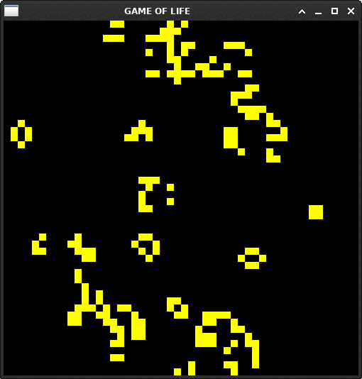

# Game of Life (C++ / SFML / OpenMP)

Implementation of Conway's Game of Life in C++17, with a graphical interface using SFML.



## 🚀 Features
- Graphical display with SFML
- Configurable grid size, pixel size, and speed
- Optional parallelism with OpenMP
- Pause / resume with **Space**, quit with **Q** or **Escape**

## 🛠️ Build

Requirements:
- C++17 compiler
- [CMake >= 3.10](https://cmake.org)
- [SFML >= 2.5](https://www.sfml-dev.org)
- (optional) OpenMP

## 💡 Steps

```bash
git clone https://github.com/YOUR_USERNAME/game_of_life.git
cd game_of_life
cmake -S . -B build
cmake --build build
```

## ✅ Run

```bash
./build/game_of_life --width 100 --height 100 --pixel 5 -s 100
```

## ⚙️ Options

- -p, --pause : start paused
- --width <N> : number of cells horizontally
- --height <N> : number of cells vertically
- --pixel <N> : pixel size of cells
- -s, --speed <ms> : delay between iterations in ms
- -h, --help : show help

## 📜 License

MIT